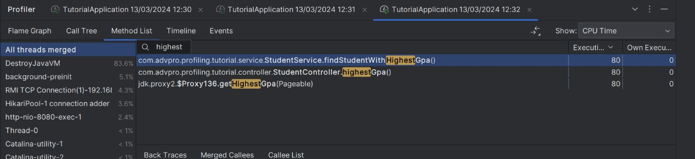

    
Module 5

<h2>Comparison</h2>

* JMeter tests  
  * all-student (before)  
    
  * all-student (after)  
    
  * all-student-name (before)  
    
  * all-student-name (after)  
    
  * highest-gpa (before)  
    
  * highest-gpa (after)  
    
  
* JMeter Command Line Test
  * all-student
  
  * all-student-name
  
  * highest-gpa
  
  
* Profiling
  * all-student (before)
  
  * all-student (after)
  
  * all-student-name (before)
  
  * all-student-name (after)
  
  * highest-gpa (before)
  
  * highest-gpa (after)
  
  
<h2>Reflection</h2>
1. What is the difference between the approach of performance testing with JMeter and profiling with IntelliJ Profiler 
  in the context of optimizing application performance?  
   > IntelliJ profiling provides detailed insights into how your application behaves at runtime, helping you pinpoint 
  specific areas of improvement in your code while performance testing with JMeter will measure and analyze how your 
  application performs under various loads which helps you understand the overall performance characteristics of your 
  application under different conditions.  
2. How does the profiling process help you in identifying and understanding the weak points in your application?  
    > Providing detailed information about the execution flow and resource consumption of your application, Highlighting 
areas of the code that consume the most CPU time, memory, or other resources, Identifying potential memory leaks or 
inefficient algorithms, and others.  
3. Do you think IntelliJ Profiler is effective in assisting you to analyze and identify bottlenecks in your application 
code?  
    > Yes, I can know which part of my code that I can optimize.  
4. What are the main challenges you face when conducting performance testing and profiling, and how do you overcome 
these challenges?  
    > One of the challenges is testing the scalability of the system to handle a large number of users or transactions.
To overcome it, I use load testing tools like JMeter to simulate a large number of users and transactions.  
5. What are the main benefits you gain from using IntelliJ Profiler for profiling your application code?  
    > Detailed insights, real time monitoring, integration with other IntelliJ tools, and many more.  
6. How do you handle situations where the results from profiling with IntelliJ Profiler are not entirely consistent with 
findings from performance testing using JMeter?  
    > Review the data collected by IntelliJ Profiler to understand the specific performance metrics, such as CPU usage, 
memory allocation, and thread activity. Look for any anomalies or unexpected behavior that could explain the 
reasons of the inconsistency.  
7. What strategies do you implement in optimizing application code after analyzing results from performance testing and 
profiling? How do you ensure the changes you make do not affect the application's functionality?  
    > I try to focus on optimizing parts of my code that consumes the most resources. uSE Git to track changes to your
code and easily revert back to a previous state if needed to ensure the changes I make does not affect the application's 
functionality.  

